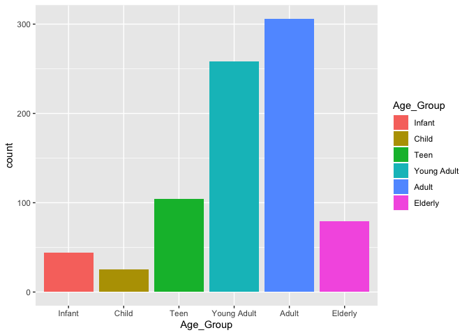
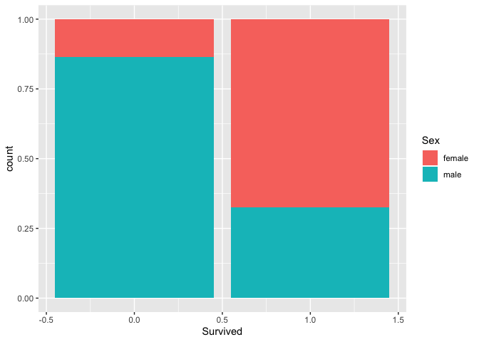

Titanic
================
John Russell
1/7/2020

## Introduction

When examining the improbable tragedy of the sinking of the Titanic in
1912, it is a reasonable assumption to believe that there was a
predictable pattern to who on board survived and who died. It is my
belief that women and younger passengers had a greater chance of
surviving due to those groups likely taking priority when filling the
lifeboats. A thorough analysis will be conducted to test this
hypothesis.

## Data and Feature Engineering

``` r
glimpse(train_data)
```

    ## Observations: 891
    ## Variables: 12
    ## $ PassengerId <dbl> 1, 2, 3, 4, 5, 6, 7, 8, 9, 10, 11, 12, 13, 14, 15, 16, 17…
    ## $ Survived    <dbl> 0, 1, 1, 1, 0, 0, 0, 0, 1, 1, 1, 1, 0, 0, 0, 1, 0, 1, 0, …
    ## $ Pclass      <dbl> 3, 1, 3, 1, 3, 3, 1, 3, 3, 2, 3, 1, 3, 3, 3, 2, 3, 2, 3, …
    ## $ Name        <chr> "Braund, Mr. Owen Harris", "Cumings, Mrs. John Bradley (F…
    ## $ Sex         <chr> "male", "female", "female", "female", "male", "male", "ma…
    ## $ Age         <dbl> 22, 38, 26, 35, 35, NA, 54, 2, 27, 14, 4, 58, 20, 39, 14,…
    ## $ SibSp       <dbl> 1, 1, 0, 1, 0, 0, 0, 3, 0, 1, 1, 0, 0, 1, 0, 0, 4, 0, 1, …
    ## $ Parch       <dbl> 0, 0, 0, 0, 0, 0, 0, 1, 2, 0, 1, 0, 0, 5, 0, 0, 1, 0, 0, …
    ## $ Ticket      <chr> "A/5 21171", "PC 17599", "STON/O2. 3101282", "113803", "3…
    ## $ Fare        <dbl> 7.2500, 71.2833, 7.9250, 53.1000, 8.0500, 8.4583, 51.8625…
    ## $ Cabin       <chr> NA, "C85", NA, "C123", NA, NA, "E46", NA, NA, NA, "G6", "…
    ## $ Embarked    <chr> "S", "C", "S", "S", "S", "Q", "S", "S", "S", "C", "S", "S…

A quick look at the data shows that there are 891 passengers as well as
12 different variables, including whether or not the passenger survived.

``` r
train_data <- train_data %>%
  select(-c(Cabin, Ticket))
```

We quickly notice that the Cabin number of passengers in rarely present,
so we will omit this variable from the analysis as it does not provide
any useful information for the prediction.

To properly examine age, it will be grouped as infant (0-5), child
(6-12), teenager (13-19), young adult (20-29), adult (30-49), and
elderly (50+). Before we can group the passengers, we need to deal with
the patients with no age recorded.

``` r
train_data %>%
  mutate(Ageless = is.na(Age)) %>%
  count(Ageless)
```

    ## # A tibble: 2 x 2
    ##   Ageless     n
    ##   <lgl>   <int>
    ## 1 FALSE     714
    ## 2 TRUE      177

We see that there are 177 passengers that do not have a recorded age in
the data set. That is too many to just remove from the data set. In
order to deal with this, we will use the other variables to find the
most liekly age group for the passengers with no age and use the average
value of that group to estimate the age. Because we are using age
groups, the actual value is less important.

``` r
train_data <- train_data %>%
  mutate(Famsize = SibSp + Parch)

find_age <- group_by(train_data, Pclass, Sex, Fare, Famsize) %>%
  summarise(Avg_age = mean(Age, na.rm = T))
```

Now that we have an average age for passengers based on ticket class,
gender, and the size of the family, we can assign this average age to
the passengers with no recorded age.

``` r
train_data <- train_data %>%
  inner_join(find_age)
```

    ## Joining, by = c("Pclass", "Sex", "Fare", "Famsize")

``` r
train_data %>%
  count(is.na(Avg_age))
```

    ## # A tibble: 2 x 2
    ##   `is.na(Avg_age)`     n
    ##   <lgl>            <int>
    ## 1 FALSE              816
    ## 2 TRUE                75

``` r
for (i in 1:length(train_data$Age)){
  if (is.na(train_data$Age[i])){
    train_data$Age[i] <- train_data$Avg_age[i]
  }
}

train_data %>%
  count(is.nan(Age))
```

    ## # A tibble: 2 x 2
    ##   `is.nan(Age)`     n
    ##   <lgl>         <int>
    ## 1 FALSE           816
    ## 2 TRUE             75

Now we see that there are only 7 passengers that are missing their age,
and they all are part of the same family. We will remove these
observations from the data set.

Now that we have the ages accounted for, we can finish the featue
engineering by creating the variable `Age_Group` and creating factors
for `embarked`.

``` r
train_data <- train_data %>%
  select(-c(SibSp, Parch, Avg_age)) %>%
  filter(!is.nan(Age)) %>%
  mutate(Age_Group = cut(Age, breaks = c(0, 5, 12, 19, 29, 49, 80), labels = c("Infant", "Child", "Teen", "Young Adult", "Adult", "Elderly")))

train_data$Embarked <- factor(train_data$Embarked)
```

We will save this updated training data set as a new CSV file.

``` r
write_csv(train_data, path = "tidy_titanic")
```

## Visualization

Now that we have our variables transformed, we can start to examine the
data. The first thing we will do is look at the correlation between the
predictors.

``` r
cor(train_data[, -c(2, 4:5, 8, 10)])
```

    ##             PassengerId      Pclass         Age        Fare     Famsize
    ## PassengerId  1.00000000 -0.04043922  0.04778875  0.01585238 -0.05063692
    ## Pclass      -0.04043922  1.00000000 -0.37178418 -0.55066394  0.01640378
    ## Age          0.04778875 -0.37178418  1.00000000  0.09248151 -0.29821436
    ## Fare         0.01585238 -0.55066394  0.09248151  1.00000000  0.22690981
    ## Famsize     -0.05063692  0.01640378 -0.29821436  0.22690981  1.00000000

Most of what we see is expected. For example, the `Fare` is moderately
negatively correlated with the `Pclass`, or ticket class. This means
that the better the class (i.e. 1<sup>st</sup>) will have more expensive
tickets. We now look at some graphs.

A simple bar chart will show us the survival based on age group.

``` r
ggplot(train_data) +
  geom_bar(aes(Age_Group, fill = Age_Group))
```

<!-- -->

A percentage of survival based on age group will be more informative.

``` r
 by_age <- train_data %>%
  group_by(Age_Group) %>%
  summarise(prop_lived = sum(Survived == 1) / n()) 

ggplot(by_age) +
  geom_col(aes(Age_Group, prop_lived, fill = Age_Group))
```

<!-- -->

Now that we have a proportion of who lived by age group, we can see that
it is true that young passengers did indeed have a greater chance of
surviving, likely due to priority on the life boats. Now for gender.

Like with age, a simple bar chart will tell us a lot about how one group
survives compared to the other.

``` r
ggplot(train_data) +
  geom_bar(aes(Survived, fill = Sex), position = "fill")
```

<!-- -->

## Model Selection

Since we are dealing with a classification problem, we will consider a
few different modeling methods: logistic regression, linear discriminant
analysis, and quadratic discriminant analysis.
