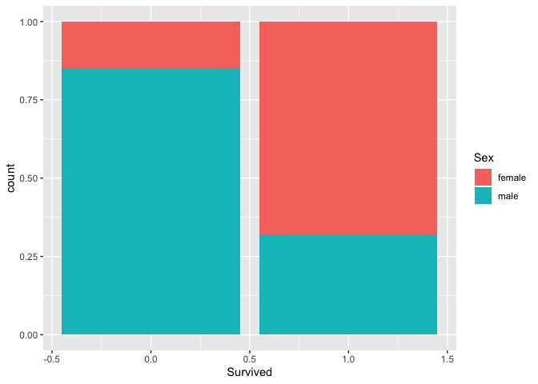
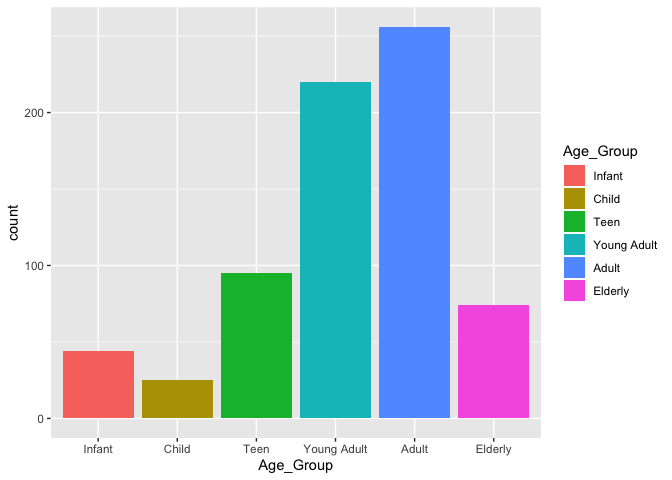
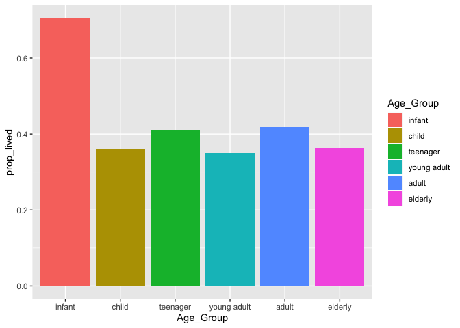

Titanic
================
John Russell
1/7/2020

## Introduction

When examining the improbable tragedy of the sinking of the Titanic in
1912, it is a reasonable assumption to believe that there was a
predictable pattern to who on board survived and who died. It is my
belief that women and younger passengers had a greater chance of
surviving due to those groups likely taking priority when filling the
lifeboats. A thorough analysis will be conducted to test this
hypothesis.

## Analysis

``` r
glimpse(train_data)
```

    ## Observations: 891
    ## Variables: 12
    ## $ PassengerId <dbl> 1, 2, 3, 4, 5, 6, 7, 8, 9, 10, 11, 12, 13, 14, 15, 16, 17…
    ## $ Survived    <dbl> 0, 1, 1, 1, 0, 0, 0, 0, 1, 1, 1, 1, 0, 0, 0, 1, 0, 1, 0, …
    ## $ Pclass      <dbl> 3, 1, 3, 1, 3, 3, 1, 3, 3, 2, 3, 1, 3, 3, 3, 2, 3, 2, 3, …
    ## $ Name        <chr> "Braund, Mr. Owen Harris", "Cumings, Mrs. John Bradley (F…
    ## $ Sex         <chr> "male", "female", "female", "female", "male", "male", "ma…
    ## $ Age         <dbl> 22, 38, 26, 35, 35, NA, 54, 2, 27, 14, 4, 58, 20, 39, 14,…
    ## $ SibSp       <dbl> 1, 1, 0, 1, 0, 0, 0, 3, 0, 1, 1, 0, 0, 1, 0, 0, 4, 0, 1, …
    ## $ Parch       <dbl> 0, 0, 0, 0, 0, 0, 0, 1, 2, 0, 1, 0, 0, 5, 0, 0, 1, 0, 0, …
    ## $ Ticket      <chr> "A/5 21171", "PC 17599", "STON/O2. 3101282", "113803", "3…
    ## $ Fare        <dbl> 7.2500, 71.2833, 7.9250, 53.1000, 8.0500, 8.4583, 51.8625…
    ## $ Cabin       <chr> NA, "C85", NA, "C123", NA, NA, "E46", NA, NA, NA, "G6", "…
    ## $ Embarked    <chr> "S", "C", "S", "S", "S", "Q", "S", "S", "S", "C", "S", "S…

A quick look at the data shows that there are 891 passengers as well as
12 different variables, including whether or not the passenger survived.

``` r
train_data <- train_data %>%
  select(-c(Cabin, Ticket))
```

We quickly notice that the Cabin number of passengers in rarely present,
so we will omit this variable from the analysis as it does not provide
any useful information.

``` r
ggplot(train_data) +
  geom_bar(aes(Survived, fill = Sex), position = "fill")
```

<!-- -->

A quick visualization of the data shows that the majority of the
passengers that survived are, in fact, female.

To properly examine age, it will be grouped as infant (0-5), child
(6-12), teenager (13-19), young adult (20-29), adult (30-49), and
elderly (50+). Passengers with unknown age will be ommitted.

``` r
train_data <- train_data %>%
  filter(!is.na(Age)) %>%
  mutate(Age_Group = cut(Age, breaks = c(0, 5, 12, 19, 29, 49, 80), labels = c("infant", "child", "teenager", "young adult", "adult", "elderly")))
```

``` r
ggplot(train_data) +
  geom_bar(aes(Age_Group, fill = Age_Group))
```

<!-- -->

A percentage of survival based on age group will be more informative.

``` r
 by_age <- train_data %>%
  group_by(Age_Group) %>%
  summarise(prop_lived = sum(Survived == 1) / n()) 

ggplot(by_age) +
  geom_col(aes(Age_Group, prop_lived, fill = Age_Group))
```

<!-- -->

Now that we have a proportion of who lived by age group, we can see that
it is true that young passengers did indeed have a greater chance of
surviving, likely due to priority on the life boats.

With a basic idea of what to expect from the graphs, it is time to start
building a model to predict survival.
