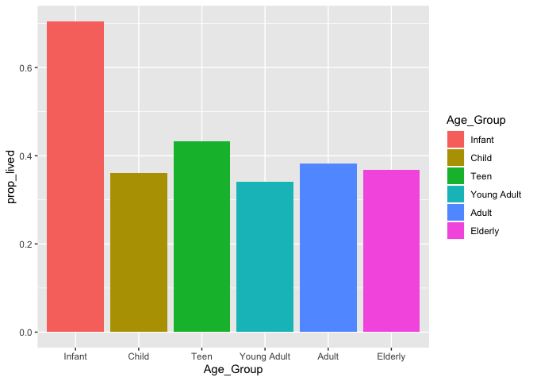

Titanic
================
John Russell
1/7/2020

## Introduction

When examining the improbable tragedy of the sinking of the Titanic in
1912, it is a reasonable assumption to believe that there was a
predictable pattern to who on board survived and who died. It is my
belief that women and younger passengers had a greater chance of
surviving due to those groups likely taking priority when filling the
lifeboats. A thorough analysis will be conducted to test this
hypothesis.

## Data and Feature Engineering

``` r
glimpse(train_data)
```

    ## Observations: 891
    ## Variables: 12
    ## $ PassengerId <dbl> 1, 2, 3, 4, 5, 6, 7, 8, 9, 10, 11, 12, 13, 14, 15, 16, 17…
    ## $ Survived    <dbl> 0, 1, 1, 1, 0, 0, 0, 0, 1, 1, 1, 1, 0, 0, 0, 1, 0, 1, 0, …
    ## $ Pclass      <dbl> 3, 1, 3, 1, 3, 3, 1, 3, 3, 2, 3, 1, 3, 3, 3, 2, 3, 2, 3, …
    ## $ Name        <chr> "Braund, Mr. Owen Harris", "Cumings, Mrs. John Bradley (F…
    ## $ Sex         <chr> "male", "female", "female", "female", "male", "male", "ma…
    ## $ Age         <dbl> 22, 38, 26, 35, 35, NA, 54, 2, 27, 14, 4, 58, 20, 39, 14,…
    ## $ SibSp       <dbl> 1, 1, 0, 1, 0, 0, 0, 3, 0, 1, 1, 0, 0, 1, 0, 0, 4, 0, 1, …
    ## $ Parch       <dbl> 0, 0, 0, 0, 0, 0, 0, 1, 2, 0, 1, 0, 0, 5, 0, 0, 1, 0, 0, …
    ## $ Ticket      <chr> "A/5 21171", "PC 17599", "STON/O2. 3101282", "113803", "3…
    ## $ Fare        <dbl> 7.2500, 71.2833, 7.9250, 53.1000, 8.0500, 8.4583, 51.8625…
    ## $ Cabin       <chr> NA, "C85", NA, "C123", NA, NA, "E46", NA, NA, NA, "G6", "…
    ## $ Embarked    <chr> "S", "C", "S", "S", "S", "Q", "S", "S", "S", "C", "S", "S…

``` r
train_data %>%
  group_by(Survived) %>%
  count()
```

    ## # A tibble: 2 x 2
    ## # Groups:   Survived [2]
    ##   Survived     n
    ##      <dbl> <int>
    ## 1        0   549
    ## 2        1   342

A quick look at the data shows that there are 891 passengers as well as
12 different variables, including whether or not the passenger survived.
We see that over half of the passengers are listed as having a 0 for the
`Survived` variable, indicating that that passenger did not survive.

``` r
train_data <- train_data %>%
  select(-c(Cabin, Ticket))
```

We quickly notice that the Cabin number of passengers in rarely present,
so we will omit this variable from the analysis as it does not provide
any useful information for the prediction.

To properly examine age, it will be grouped as infant (0-5), child
(6-12), teenager (13-19), young adult (20-29), adult (30-49), and
elderly (50+). Before we can group the passengers, we need to deal with
the patients with no age recorded.

``` r
train_data %>%
  mutate(Ageless = is.na(Age)) %>%
  count(Ageless)
```

    ## # A tibble: 2 x 2
    ##   Ageless     n
    ##   <lgl>   <int>
    ## 1 FALSE     714
    ## 2 TRUE      177

We see that there are 177 passengers that do not have a recorded age in
the data set. That is too many to just remove from the data set. In
order to deal with this, we will use the other variables to find the
most liekly age group for the passengers with no age and use the average
value of that group to estimate the age. Because we are using age
groups, the actual value is less important.

``` r
train_data <- train_data %>%
  mutate(Famsize = SibSp + Parch)

find_age <- group_by(train_data, Pclass, Sex, Fare, Famsize) %>%
  summarise(Avg_age = mean(Age, na.rm = T))
```

Now that we have an average age for passengers based on ticket class,
gender, and the size of the family, we can assign this average age to
the passengers with no recorded age.

``` r
train_data <- train_data %>%
  inner_join(find_age)
```

    ## Joining, by = c("Pclass", "Sex", "Fare", "Famsize")

``` r
train_data %>%
  count(is.na(Avg_age))
```

    ## # A tibble: 2 x 2
    ##   `is.na(Avg_age)`     n
    ##   <lgl>            <int>
    ## 1 FALSE              816
    ## 2 TRUE                75

``` r
for (i in 1:length(train_data$Age)){
  if (is.na(train_data$Age[i])){
    train_data$Age[i] <- train_data$Avg_age[i]
  }
}

train_data %>%
  count(is.nan(Age))
```

    ## # A tibble: 2 x 2
    ##   `is.nan(Age)`     n
    ##   <lgl>         <int>
    ## 1 FALSE           816
    ## 2 TRUE             75

Now we see that there are only 7 passengers that are missing their age,
and they all are part of the same family. We will remove these
observations from the data set.

Now that we have the ages accounted for, we can finish the featue
engineering by creating the variable `Age_Group` and creating factors
for `embarked`.

``` r
train_data <- train_data %>%
  select(-c(SibSp, Parch, Avg_age)) %>%
  filter(!is.nan(Age)) %>%
  mutate(Age_Group = cut(Age, breaks = c(0, 5, 12, 19, 29, 49, 80), labels = c("Infant", "Child", "Teen", "Young Adult", "Adult", "Elderly")))

train_data$Embarked <- factor(train_data$Embarked)
```

We will save this updated training data set as a new CSV file.

``` r
write_csv(train_data, path = "tidy_titanic.csv")
```

## Visualization

Now that we have our variables transformed, we can start to examine the
data. The first thing we will do is look at the correlation between the
predictors.

``` r
cor(train_data[, -c(2, 4:5, 8, 10)])
```

    ##             PassengerId      Pclass         Age        Fare     Famsize
    ## PassengerId  1.00000000 -0.04043922  0.04778875  0.01585238 -0.05063692
    ## Pclass      -0.04043922  1.00000000 -0.37178418 -0.55066394  0.01640378
    ## Age          0.04778875 -0.37178418  1.00000000  0.09248151 -0.29821436
    ## Fare         0.01585238 -0.55066394  0.09248151  1.00000000  0.22690981
    ## Famsize     -0.05063692  0.01640378 -0.29821436  0.22690981  1.00000000

Most of what we see is expected. For example, the `Fare` is moderately
negatively correlated with the `Pclass`, or ticket class. This means
that the better the class (i.e. 1<sup>st</sup>) will have more expensive
tickets. We now look at some graphs.

A simple bar chart will show us the survival based on age group.

``` r
ggplot(train_data) +
  geom_bar(aes(Age_Group, fill = Age_Group))
```

<!-- -->

A percentage of survival based on age group will be more informative.

``` r
 by_age <- train_data %>%
  group_by(Age_Group) %>%
  summarise(prop_lived = sum(Survived == 1) / n()) 

ggplot(by_age) +
  geom_col(aes(Age_Group, prop_lived, fill = Age_Group))
```

<!-- -->

Now that we have a proportion of who lived by age group, we can see that
it is true that young passengers did indeed have a greater chance of
surviving, likely due to priority on the life boats. Now for gender.

Like with age, a simple bar chart will tell us a lot about how one group
survives compared to the other.

``` r
by_sex <- train_data %>%
  group_by(Sex) %>%
  summarise(proportion_lived = sum(Survived == 1) / n())

ggplot(by_sex) +
  geom_col(aes(Sex, proportion_lived, fill = Sex))
```

<!-- -->

Gender is clearly a significant factor that determined which passengers
survived. With both of these predictors analyzed visually, we can start
building the model.

## Model Selection

Since we are dealing with a classification problem, we will consider a
few different modeling methods: logistic regression, linear discriminant
analysis, and quadratic discriminant analysis. Because we are dealing
with a response that has two classes, logistic regression seems like a
good place to
start.

``` r
log_fit <- glm(Survived ~ Pclass + Sex + Fare + Embarked + Famsize + Age_Group, data = train_data, family = binomial)

summary(log_fit)
```

    ## 
    ## Call:
    ## glm(formula = Survived ~ Pclass + Sex + Fare + Embarked + Famsize + 
    ##     Age_Group, family = binomial, data = train_data)
    ## 
    ## Deviance Residuals: 
    ##     Min       1Q   Median       3Q      Max  
    ## -3.1850  -0.5850  -0.4354   0.5852   2.3781  
    ## 
    ## Coefficients:
    ##                       Estimate Std. Error z value Pr(>|z|)    
    ## (Intercept)           6.866291   0.742787   9.244  < 2e-16 ***
    ## Pclass               -1.023584   0.154662  -6.618 3.64e-11 ***
    ## Sexmale              -2.910850   0.221666 -13.132  < 2e-16 ***
    ## Fare                  0.004642   0.003002   1.547  0.12196    
    ## EmbarkedQ            -0.071573   0.444057  -0.161  0.87195    
    ## EmbarkedS            -0.277691   0.255406  -1.087  0.27692    
    ## Famsize              -0.400870   0.094793  -4.229 2.35e-05 ***
    ## Age_GroupChild       -1.798776   0.686243  -2.621  0.00876 ** 
    ## Age_GroupTeen        -2.811223   0.575931  -4.881 1.05e-06 ***
    ## Age_GroupYoung Adult -2.922699   0.534063  -5.473 4.44e-08 ***
    ## Age_GroupAdult       -2.951963   0.526509  -5.607 2.06e-08 ***
    ## Age_GroupElderly     -3.724008   0.605905  -6.146 7.94e-10 ***
    ## ---
    ## Signif. codes:  0 '***' 0.001 '**' 0.01 '*' 0.05 '.' 0.1 ' ' 1
    ## 
    ## (Dispersion parameter for binomial family taken to be 1)
    ## 
    ##     Null deviance: 1088.31  on 813  degrees of freedom
    ## Residual deviance:  696.91  on 802  degrees of freedom
    ##   (2 observations deleted due to missingness)
    ## AIC: 720.91
    ## 
    ## Number of Fisher Scoring iterations: 5

We see that most of the variables look like they are significant. The
only exception is the `Embarked` variable. In order to build the most
accurate model, `Embarked` will be
removed.

``` r
log_fit2 <- glm(Survived ~ Pclass + Sex + Fare + Famsize + Age_Group, data = train_data, family = binomial)

summary(log_fit2, correlation = T)
```

    ## 
    ## Call:
    ## glm(formula = Survived ~ Pclass + Sex + Fare + Famsize + Age_Group, 
    ##     family = binomial, data = train_data)
    ## 
    ## Deviance Residuals: 
    ##     Min       1Q   Median       3Q      Max  
    ## -3.2345  -0.5834  -0.4444   0.5672   2.4760  
    ## 
    ## Coefficients:
    ##                       Estimate Std. Error z value Pr(>|z|)    
    ## (Intercept)           6.693322   0.720378   9.291  < 2e-16 ***
    ## Pclass               -1.024921   0.152348  -6.727 1.73e-11 ***
    ## Sexmale              -2.932086   0.219725 -13.344  < 2e-16 ***
    ## Fare                  0.005336   0.002991   1.784  0.07439 .  
    ## Famsize              -0.417195   0.094374  -4.421 9.84e-06 ***
    ## Age_GroupChild       -1.810054   0.688973  -2.627  0.00861 ** 
    ## Age_GroupTeen        -2.815826   0.575231  -4.895 9.82e-07 ***
    ## Age_GroupYoung Adult -2.953707   0.534566  -5.525 3.29e-08 ***
    ## Age_GroupAdult       -2.992421   0.527304  -5.675 1.39e-08 ***
    ## Age_GroupElderly     -3.743723   0.606412  -6.174 6.68e-10 ***
    ## ---
    ## Signif. codes:  0 '***' 0.001 '**' 0.01 '*' 0.05 '.' 0.1 ' ' 1
    ## 
    ## (Dispersion parameter for binomial family taken to be 1)
    ## 
    ##     Null deviance: 1092.07  on 815  degrees of freedom
    ## Residual deviance:  698.53  on 806  degrees of freedom
    ## AIC: 718.53
    ## 
    ## Number of Fisher Scoring iterations: 5
    ## 
    ## Correlation of Coefficients:
    ##                      (Intercept) Pclass Sexmale Fare  Famsize Age_GroupChild
    ## Pclass               -0.60                                                  
    ## Sexmale              -0.47        0.17                                      
    ## Fare                 -0.24        0.53  -0.05                               
    ## Famsize              -0.40       -0.12   0.33   -0.37                       
    ## Age_GroupChild       -0.40       -0.01   0.11   -0.03  0.04                 
    ## Age_GroupTeen        -0.69        0.00   0.27   -0.14  0.46    0.49         
    ## Age_GroupYoung Adult -0.74        0.02   0.25   -0.14  0.49    0.52         
    ## Age_GroupAdult       -0.79        0.12   0.22   -0.10  0.47    0.52         
    ## Age_GroupElderly     -0.77        0.23   0.21   -0.07  0.43    0.46         
    ##                      Age_GroupTeen Age_GroupYoung Adult Age_GroupAdult
    ## Pclass                                                                
    ## Sexmale                                                               
    ## Fare                                                                  
    ## Famsize                                                               
    ## Age_GroupChild                                                        
    ## Age_GroupTeen                                                         
    ## Age_GroupYoung Adult  0.84                                            
    ## Age_GroupAdult        0.83          0.90                              
    ## Age_GroupElderly      0.74          0.80                 0.83

All of the variables in this model are significant. But notice from the
correlation of coefficient table that there is moderately strong
correlation between `Pclass` and `Fare`. This makes since due to the
fact that lower class tickets are generally more expensive. It thus
makes sense for us to drop the least statistically signifant of the two
variables, which is
`Fare`.

``` r
log_fit3 <- glm(Survived ~ Pclass + Sex + Famsize + Age_Group, data = train_data, family = binomial)

summary(log_fit3, correlation = T)
```

    ## 
    ## Call:
    ## glm(formula = Survived ~ Pclass + Sex + Famsize + Age_Group, 
    ##     family = binomial, data = train_data)
    ## 
    ## Deviance Residuals: 
    ##     Min       1Q   Median       3Q      Max  
    ## -3.1015  -0.6028  -0.4316   0.5578   2.4545  
    ## 
    ## Coefficients:
    ##                      Estimate Std. Error z value Pr(>|z|)    
    ## (Intercept)           7.05267    0.69241  10.186  < 2e-16 ***
    ## Pclass               -1.18378    0.12810  -9.241  < 2e-16 ***
    ## Sexmale              -2.92477    0.21851 -13.385  < 2e-16 ***
    ## Famsize              -0.35582    0.08594  -4.141 3.47e-05 ***
    ## Age_GroupChild       -1.77440    0.68645  -2.585  0.00974 ** 
    ## Age_GroupTeen        -2.68060    0.56493  -4.745 2.08e-06 ***
    ## Age_GroupYoung Adult -2.82678    0.52403  -5.394 6.88e-08 ***
    ## Age_GroupAdult       -2.90339    0.52042  -5.579 2.42e-08 ***
    ## Age_GroupElderly     -3.69284    0.60116  -6.143 8.10e-10 ***
    ## ---
    ## Signif. codes:  0 '***' 0.001 '**' 0.01 '*' 0.05 '.' 0.1 ' ' 1
    ## 
    ## (Dispersion parameter for binomial family taken to be 1)
    ## 
    ##     Null deviance: 1092.07  on 815  degrees of freedom
    ## Residual deviance:  702.65  on 807  degrees of freedom
    ## AIC: 720.65
    ## 
    ## Number of Fisher Scoring iterations: 5
    ## 
    ## Correlation of Coefficients:
    ##                      (Intercept) Pclass Sexmale Famsize Age_GroupChild
    ## Pclass               -0.58                                            
    ## Sexmale              -0.49        0.22                                
    ## Famsize              -0.54        0.10   0.35                         
    ## Age_GroupChild       -0.42        0.00   0.11    0.02                 
    ## Age_GroupTeen        -0.75        0.08   0.27    0.44    0.49         
    ## Age_GroupYoung Adult -0.81        0.11   0.25    0.47    0.52         
    ## Age_GroupAdult       -0.85        0.21   0.22    0.46    0.52         
    ## Age_GroupElderly     -0.82        0.32   0.22    0.43    0.45         
    ##                      Age_GroupTeen Age_GroupYoung Adult Age_GroupAdult
    ## Pclass                                                                
    ## Sexmale                                                               
    ## Famsize                                                               
    ## Age_GroupChild                                                        
    ## Age_GroupTeen                                                         
    ## Age_GroupYoung Adult  0.83                                            
    ## Age_GroupAdult        0.83          0.90                              
    ## Age_GroupElderly      0.74          0.80                 0.83

Although the AIC of the model without `Fare` is slighlty higher than the
model with it, it is not significant enough for us to keep `Fare` in the
model. Thus the third fit is what we will be going with. The
coeeficients of the model are listed
    below.

``` r
summary(log_fit3)$coef
```

    ##                        Estimate Std. Error    z value     Pr(>|z|)
    ## (Intercept)           7.0526653 0.69241076  10.185667 2.297793e-24
    ## Pclass               -1.1837807 0.12809832  -9.241188 2.437749e-20
    ## Sexmale              -2.9247735 0.21850887 -13.385148 7.385005e-41
    ## Famsize              -0.3558243 0.08593701  -4.140524 3.465128e-05
    ## Age_GroupChild       -1.7743952 0.68644519  -2.584904 9.740600e-03
    ## Age_GroupTeen        -2.6805969 0.56492737  -4.745029 2.084762e-06
    ## Age_GroupYoung Adult -2.8267752 0.52402716  -5.394330 6.877989e-08
    ## Age_GroupAdult       -2.9033884 0.52042447  -5.578885 2.420649e-08
    ## Age_GroupElderly     -3.6928410 0.60115914  -6.142868 8.104484e-10

Interestingly enough, every predictor appears to increase the odds of a
passenger dying since they are all negative with the exception of the
intercept. When we remember that the majority of the passengers did not
survive, this is explainable.

## Prediction

Now that we have selected a model, it is time to make some predictions.
We use the `predict` function in conjunction with the test data set to
see whether a given passenger is likely to survive. First, we will tidy
the test data in the same manner as the training data.

``` r
test_data <- read_csv('test.csv')
```

    ## Parsed with column specification:
    ## cols(
    ##   PassengerId = col_double(),
    ##   Pclass = col_double(),
    ##   Name = col_character(),
    ##   Sex = col_character(),
    ##   Age = col_double(),
    ##   SibSp = col_double(),
    ##   Parch = col_double(),
    ##   Ticket = col_character(),
    ##   Fare = col_double(),
    ##   Cabin = col_character(),
    ##   Embarked = col_character()
    ## )
